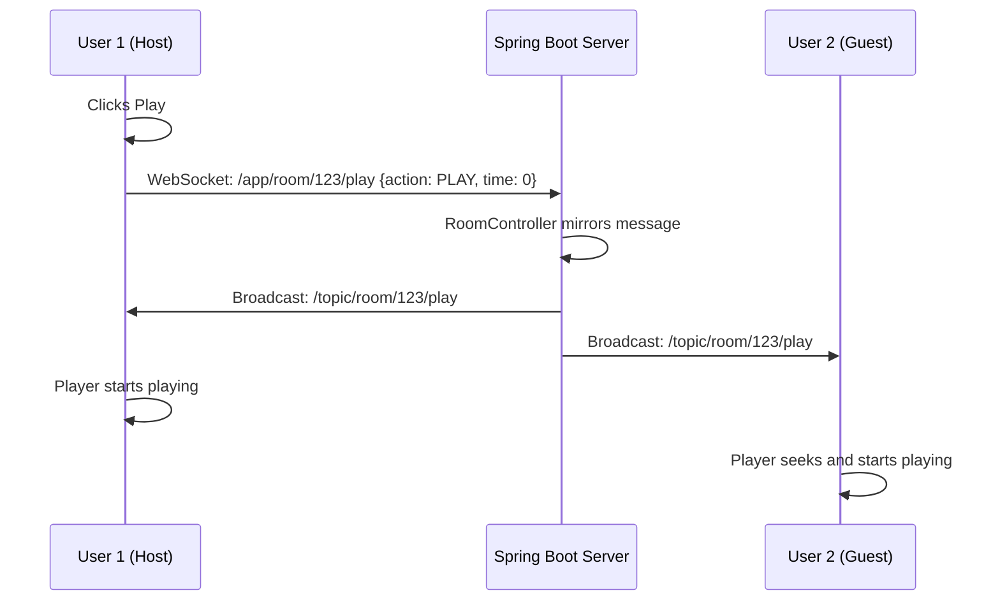
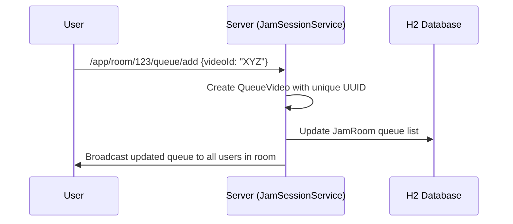

# Jam Tube: System Design Report
## Collaborative Music & Video Synchronization Platform

### 1. System Architecture Overview

Jam Tube is a real-time collaborative platform that allows users to create music "rooms" where they can search for YouTube videos, add them to a shared queue, and watch them in perfect synchronization. 

The system follows a **decoupled client-server architecture**:
- **Backend:** Built with **Spring Boot**, managing room states, user lists, and the video queue. It uses **WebSockets (STOMP)** for real-time event broadcasting and **REST** for search discovery.
- **Frontend:** A **React** single-page application that provides a modern UI for room interaction, searching, and synchronized video playback via the YouTube IFrame API.
- **Data Layer:** Currently uses an **H2 in-memory database** with JPA/Hibernate for persisting room and queue information during the session.

---

### 2. Backend Breakdown (`src/main/java/com/example/demo/`)

#### 2.1 Services (`/service`)

##### `YoutubeSearchService.java`
- **Purpose:** Handles all integrations with the YouTube Data API v3.
- **Key Method: `searchVideo(String query)`**
  - **Function:** Makes an authorized HTTP GET request to YouTube's search endpoint.
  - **Logic:** Extracts the video ID, title, and thumbnail URL from the JSON response and returns them as a list of `SearchResult` objects.
  - **Why:** Acts as a gateway to external media content.

##### `JamSessionService.java`
- **Purpose:** The core engine for room and queue management.
- **Key Methods:**
  - **`createRoom(String hostUsername)`**: Generates a unique 6-character room code and saves a new `JamRoom` entity.
  - **`addUserToRoom(String roomId, String username)`**: Adds a participant to a room and returns the updated user list.
  - **`addVideoToQueue(String roomId, SearchResult video)`**: Converts a search result into a `QueueVideo` (with a unique UUID) and appends it to the room's persistent list.
  - **`popVideoFromQueue(String roomId)`**: Removes the first item from the queue list after it has finished playing.
  - **Why:** Centralizes business logic to ensure the database state is always consistent.

#### 2.2 Controllers (`/controller`)

##### `SearchController.java`
- **Purpose:** Provides a REST API for the frontend to perform searches.
- **Method: `search(@RequestParam String search)`**: A simple GET endpoint that proxies requests to the `YoutubeSearchService`.

##### `RoomRestController.java`
- **Purpose:** Handles standard HTTP-based room lifecycle actions.
- **Key Methods:**
  - **`createRoom(@RequestBody Map hostUsername)`**: Entry point for starting a new session.
  - **`getRoom(@PathVariable String roomId)`**: Fetches current room details when a user joins or refreshes.
  - **`endSession(...)` & `removeUser(...)`**: Administrative actions reserved for the host.

##### `RoomController.java`
- **Purpose:** Manages real-time WebSocket communication.
- **Key Methods:**
  - **`joinRoom(...)`**: Broadcasts the current user list when someone enters the room.
  - **`handlePlayBack(...)`**: Receives a Play/Pause command from one user and immediately broadcasts it to everyone else in the room (Mirroring).
  - **`addToQueue(...)`**: Receives a video choice and broadcasts the updated queue to all participants.
  - **`nextInQueue(...)`**: Triggered when a video ends; it pops the top item and syncs the new queue state.

#### 2.3 Entities (`/entity`)

- **`JamRoom.java`**: The primary database model. Stores `roomId`, `hostUsername`, `participants` (Set), and the `queue` (List of QueueVideos).
- **`QueueVideo.java`**: Extends `SearchResult` with a unique `queueId` to allow the same song to appear multiple times in the queue.
- **`SearchResult.java`**: A base class for video metadata (ID, title, thumbnail).

---

### 3. Frontend Breakdown (`jam-frontend/src/`)

#### 3.1 Main Application (`App.jsx`)

##### State Variables
- **`isInRoom`**: Controls whether to show the login screen or the room dashboard.
- **`queue`**: Local state storing the current list of upcoming videos.
- **`currentVideoId`**: Controls which video is currently loaded in the YouTube player.
- **`isHost`**: Determines if the user sees administrative controls (End Session, Remove User).

##### WebSocket Management (`connectWebSocket`)
- Uses the `@stomp/stompjs` library to connect to the backend.
- **Subscriptions:**
  - `/topic/room/{id}`: Listens for user join/leave events.
  - `/topic/room/{id}/play`: The "heart" of the app. It listens for `PLAY` or `PAUSE` actions and command the local `playerRef` (YouTube player) to seek and play.
  - `/topic/room/{id}/queue`: Listens for any changes to the music queue.

##### Playback Sync Logic
- **`broadcastPlay(videoId, timestamp)`**: Published by a user (usually the host) to tell everyone to start playing a specific video at a specific time.
- **`handleNext()`**: The bridge between queue and playback. It tells the backend to remove the finished song and tells the room to play the next one.

---

### 4. System Flow Diagrams

#### 4.1 Playback Synchronization Flow

#### 4.2 Queue Management Flow

---

### 5. API Documentation

#### 5.1 REST Endpoints (HTTP)
| Endpoint | Method | Description |
| :--- | :--- | :--- |
| `/api/search` | GET | Searches YouTube for videos. Returns `List<SearchResult>`. |
| `/api/rooms/create` | POST | Creates a new room. Body: `{hostUsername}`. |
| `/api/rooms/{id}` | GET | Returns room data (users, queue, host). |

#### 5.2 WebSocket Endpoints (STOMP)
| Destination | Type | Payload | Description |
| :--- | :--- | :--- | :--- |
| `/app/room/{id}/join` | IN | `{username}` | Announces arrival to the room. |
| `/app/room/{id}/play` | IN | `{action, timestamp, videoId}` | Sends a playback command to everyone. |
| `/app/room/{id}/queue/add` | IN | `SearchResult` | Adds a song to the shared queue. |
| `/topic/room/{id}/queue` | OUT | `List<QueueVideo>` | Broadcasts the current queue state. |
